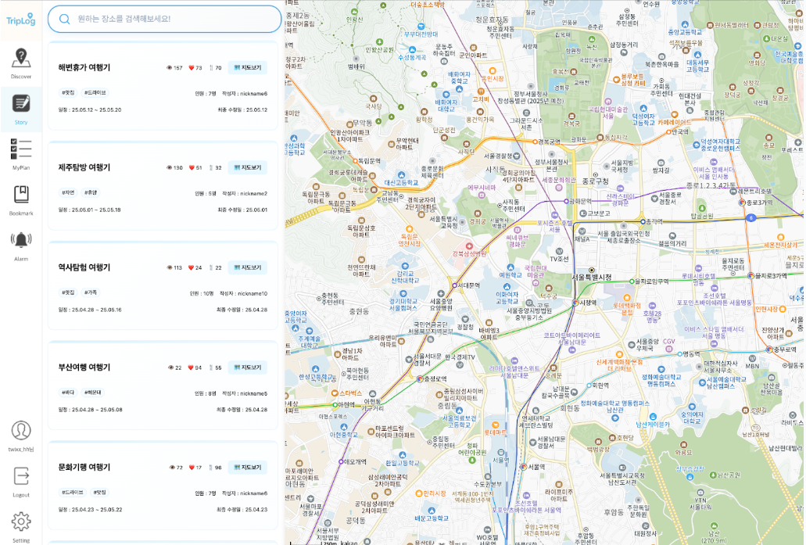
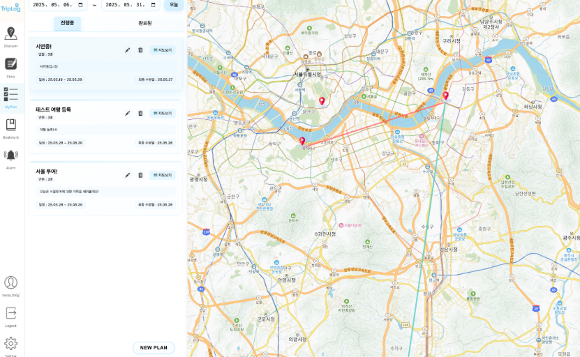

# 최종 관통 프로젝트

# TripLog

**지도 기반 여행 일정 계획 및 공유 웹 애플리케이션**

---

## 프로젝트 개요

**TripLog**는 지도를 활용하여 여행 일정을 직관적으로 계획하고, 다른 사람들과 공유할 수 있는 플랫폼입니다.  
관광지 검색, 여행 일정 생성 및 시각화, 사용자간 공유 기능을 제공하며, 성능 높은 검색 경험을 위해 다양한 기술과 검색 최적화 기법을 적용했습니다.

---

## 프로젝트 기간

**2025.05.07 ~ 2025.05.27**

---

## 팀원

- 이주현  
- 박재호

---

## 주요 기능

- 관광지 키워드 기반 검색 및 지도 시각화
- 일정 기반 관광지 경로 표시 (카카오맵 / Tmap 연동)
- 사용자 맞춤 관광지 추천 (TF-IDF 기반 유사도 계산)
- 여행 일정 작성, 수정, 공유 기능
- 회원가입 및 JWT 기반 인증/인가
- Swagger를 통한 API 명세 제공
- 검색 성능 비교 테스트 (MySQL vs Elasticsearch)

---

## 기술 스택

### Backend

- Java 17
- Spring Boot 3
- Spring Security + JWT
- MyBatis
- MySQL
- Swagger (Springdoc)
- Elasticsearch (검색 최적화)

### Frontend

- Vue 3 (Composition API)
- Kakao Map API
- Tmap API

---

## 성능 최적화 실험

- **목표**: 빠르고 정확한 관광지 검색 기능 구현
- **시도한 방식**
  - MySQL 기반 Like 검색, Fulltext 검색
  - MySQL 복합 인덱스 및 역정규화 기반 성능 향상
  - Elasticsearch를 활용한 자연어 기반 검색 (Match, Multi-Match)
- **결과**
  - Elasticsearch는 대규모 데이터에서 뛰어난 검색 속도 및 연관도 정렬 제공
  - TF-IDF 알고리즘을 활용한 유사도 기반 관광지 추천 기능 구현

---

## 프로젝트 소개
- 지도와 모달 방식을 이용한 편리한 여행 계획, 관리, 공유 웹사이트 입니다.


# Discover

- 지도를 활용하여 여행 계획을 세웁니다.
- 여러 관광지들 정보를 검색하여 광광지들의 정보를 확인 합니다.
- 관광지를 선택하면 해당 관광지에 대한 정보들을 TF-IDF(Term Frequency - Inverse Document Frequency : 벡터를 저장하는 방식)를 이용하여 유사도가 높은 순으로 3개의 관광지를 추천 해줍니다.


## 특정 관광지에 대한 사용자들의 리뷰를 확인 할 수 있습니다.


## 특정 관광지를 사용한 계획을 확인 합니다.


# Story
## 다른 사용자가 공유한 계획을 확인합니다


## 지도보기
- 지도버기 버튼을 눌러 해당 일정의 관광지들을 날짜별로 확인합니다


## 하나의 계획 확인하기

- 일정을 선택하여 세부 내용을 확인합니다
- 날짜별, 시간순, T-Map을 사용한 이동경로 계산값 을 확인 할 수 있습니다.
- 하나의 관광지를 선택하면 해당 관광지에 대한 정보를 자세하게 확인 할 수 있습니다.
- 게시글에는 무한 댓글을 달 수 있고 확인 할 수 있습니다.


# MyPlan

- 기간을 선택하여 해당 기간에 계획되어있는 일정 진행중에서, 나머지 일정들은 완료된 버튼을 눌러 확인 할 수 있습니다.
- 지도보기 버튼을 클릭하여 일정의 관광지들을 날짜별로 확인합니다.
- New Plan 버튼을 눌러 새로운 계획을 세울 수 있습니다.




# Bookmark

- 북마크 생성, 수정, 삭제 및 북마크 리스트 읽어오기 구현


---

# 🔍 검색 API 성능 분석

## 📌 테스트 환경
- **도구**: ApacheBench (ab)
- **요청 수**: 100회
- **동시 연결 수**: 10
- **키워드**: "부산", "서울"
- **서버**: localhost:8080  
- **기준**: PostPlan에 뿌려줄 데이터를 정제하는 과정까지의 시간 측정

---

## ⚙️ 테스트 분류 및 작동 원리

### ✅ 1. 4중 JOIN + ResultType (N+1 발생)
- **작동 원리**: 단일 객체에 DTO 매핑 → 중첩 안 되어 N+1 발생
- **장점**: 간단한 DTO 매핑
- **단점**: N+1 쿼리 발생

### ✅ 2. 4중 JOIN + ResultMap
- **작동 원리**: collection, association을 활용한 중첩 구조 매핑
- **장점**: N+1 문제 해결
- **단점**: ResultMap 작성이 복잡

### ✅ 3. MySQL 테이블 역정규화 (cache-like)
- **작동 원리**: JOIN 없이 하나의 테이블에 모든 정보 삽입
- **장점**: 빠른 조회
- **단점**: 데이터 중복 심함

### ✅ 4. MySQL 일반 인덱싱 (cache-indexed)
- **작동 원리**: B-Tree 기반 인덱스
- **장점**: 조건절 WHERE에서 인덱스 사용
- **단점**: `LIKE %abc%`에서 성능 저하

### ✅ 5. MySQL 최적화 인덱싱 (cache-indexed-optimized)
- **작동 원리**: N-gram 기반 인덱스
- **장점**: 부분 문자열 검색 가능
- **단점**: 인덱스 크기 증가

### ✅ 6. MySQL FULLTEXT (cache-fulltext)
- **작동 원리**: 역색인(Inverted Index) 방식
- **장점**: LIKE보다 빠름
- **단점**: 짧은 단어 인식 불가

### ✅ 7. MySQL FULLTEXT + Relevance (cache-fulltext-relevance)
- **장점**: 연관도 점수 기반 정렬로 검색 품질 향상
- **단점**: 정확도 낮을 수 있음

### ✅ 8. MySQL FULLTEXT + Boolean (cache-fulltext-boolean)
- **장점**: 키워드 필터링 (`+`, `-`) 등 정밀 검색 가능
- **단점**: 연관도 점수 미제공

### ✅ 9. Elasticsearch - Match
- **장점**: 하나의 필드에 대해 자연어 검색, 연관도 점수 부여
- **단점**: 단일 필드 검색

### ✅ 10. Elasticsearch - Multi_Match
- **장점**: 여러 필드에 대해 가중치 기반 통합 검색
- **단점**: 성능 튜닝 필요


## 📊 테스트 결과 요약

### 🟢 HIGH Performance (800+ RPS)
- **cache-fulltext**: 985–1,222 RPS  
- **cache-fulltext-relevance**: 1,044–1,147 RPS  
- **cache-fulltext-boolean**: 972–1,042 RPS  
- **cache-like**: 835–1,032 RPS  
- **cache-indexed**: 798–1,006 RPS  
- **cache-indexed-optimized**: 781–979 RPS  

### 🟡 MEDIUM Performance (500–800 RPS)
- **elasticsearch-match**: 686–849 RPS  
- **elasticsearch-multi**: 577–705 RPS  

### 🔴 LOW Performance (<500 RPS)
- **four-join**: 268–342 RPS  
- **four-join-N+1**: 225–242 RPS  

---

## 🔍 상세 성능 분석

### 1️⃣ 캐시 기반 검색 API (📈 최고 성능군)
- **주요 시리즈**: `cache-fulltext`, `cache-fulltext-relevance`, `cache-fulltext-boolean`
- **평균 RPS**: 1,000+
- **응답 시간**: 8–10ms
- **특징**: 풀텍스트 검색 + 캐싱 최적화로 매우 우수한 성능

---

### 2️⃣ 인덱스 캐시 API (📈 고성능군)
- **주요 시리즈**: `cache-indexed`, `cache-indexed-optimized`
- **평균 RPS**: 800–1,000
- **응답 시간**: 10–13ms
- **특징**: 일반 인덱스보다 N-gram 최적화 버전이 더 빠를 수 있음

---

### 3️⃣ Elasticsearch 검색 API (🟡 중간 성능군)
- **검색 방식**:
  - Match 검색: 686–849 RPS
  - Multi Match 검색: 577–705 RPS
  - 단일 쿼리 테스트 결과: 455–494 RPS
- **응답 시간**: 13–20ms
- **특징**: 고품질 검색이 가능하나, HTTP 통신 오버헤드 존재

---

### 4️⃣ JOIN 기반 검색 API (🔴 저성능군)
- **검색 방식**:
  - `four-join`: 268–342 RPS (응답 시간 약 41ms)
  - `four-join-N+1`: 225–242 RPS (응답 시간 약 29–37ms)
- **문제점**: JOIN 쿼리 수 증가, N+1 해결에도 성능 개선 제한적

---

## ⚠️ 예상과 다른 성능 결과 분석

### ✅ Elasticsearch vs MySQL 목적 차이

| 항목             | MySQL                                   | Elasticsearch                             |
|------------------|------------------------------------------|--------------------------------------------|
| 주 용도          | 정형 데이터 트랜잭션 처리               | 비정형 데이터 고성능 검색                  |
| 접근 방식        | 로컬 DB 접근                            | HTTP 기반 REST API                         |
| 성능 최적화      | 인덱스 + 캐시 활용                      | 역색인 + 텍스트 분석기 활용                |
| 성능 우위 상황   | 데이터 적고 캐시 활용 시 빠름           | 대량 데이터에 유리, 고급 검색 기능 지원    |

---

### ✅ 데이터 수와 성능 관계
- **MySQL**: 10,000건 이하에서 성능 우수
- **Elasticsearch**:
  - 10,000건 이상부터 우세
  - 100,000건 이상 LIKE 쿼리 성능 한계 도달
  - REST API 기반 통신으로 I/O 오버헤드 발생 가능

---

### ✅ Elasticsearch 세부 설정의 영향
- 매핑 설정
- 불용어 제거
- 샤딩(Sharding) 수
- 레플리카(Replica) 수  
→ 이들 설정에 따라 성능이 크게 좌우됨

---

## 🎯 검색 최적화 전략

| 조건                    | 추천 전략                                      |
|-------------------------|------------------------------------------------|
| 데이터 수 10,000건 이하 | MySQL + 역정규화 + FULLTEXT 인덱스 사용       |
| 데이터 수 10,000건 이상 | Elasticsearch + 커스텀 매핑 설정               |
| 검색 품질 중요          | 연관도 점수 활용 (MySQL relevance, ES Match)   |
| 필드 다수 + 통합검색    | Elasticsearch Multi_Match + 가중치 설정        |

---


## 설치 및 실행 방법

```bash
# Backend
cd triplog-be
./gradlew build
java -jar build/libs/triplog-0.0.1-SNAPSHOT.jar

# Frontend
cd triplog-fe
npm install
npm run dev
# TripLog


